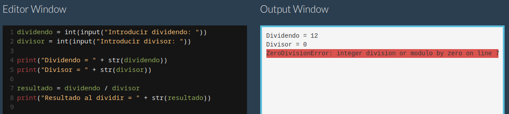

[Volver al inicio](../Readme.md)
# 1.3 Elementos de un programa y entornos de desarrollo
## 1.3.1 Código fuente
Entendemos como código fuente al conjunto de líneas de instrucciones que, una vez compilado, será ejecutado por el procesador. Para hablar del código fuente, nos centraremos en el lenguaje **PYTHON**.
### 1.3.1.1 Comentarios
Los comentarios permite añadir información al código para que pueda ser más entendible. EStos comentarios serán ignorados por el procesador.
La forma de escribir un comentario en Python es:

```Python
#Esto es un comentario
```

### 1.3.1.2 Imprimir texto
Nos permite mostrar texto al usuario del programa para interactuar con él:

```Python
print ("Este texto será mostrado al usuario...")
```

### 1.3.1.3 Variables
Las variables permiten guardar o inicializar valores/datos durante la ejecución. En Python se construyen mediante caracteres alfanuméricos y/o la barra baja "_".

Son sensibles a las mayúsculas y minúsculas, por lo que no es lo mismo "valor" que "Valor" o "vAlor", se trataría de variables distintas.

```Python
x = 5
nombre = "Ana"

print (x) # Mostrará 5 por pantalla
print (nombre) # Mostrará Ana por pantalla
```
El 'tipo' de las variables se toma en función de su contenido, por lo que dichas variables no cesitan ser tipadas previamente:

```Python
x = 3  # x será una variable de tipo entero 
y = "3" # y será una variable de tipo string (str)
  ```
Esto implica que ciertas operaciones no se puedan realizar, veamos un ejemplo:


La solución pasa por realizar un **CAST** sobre la variable de tipo String, de forma que la convertimos al tipo de datos que nos interesa, en este caso un entero:


También permite realizar código compacto, por ejemplo asignaciones múltiples en una sola línea:

``` Python
a, b, c = 1, 3, 25
# a vale 1, b vale 3 y c vale 25
```
Las variables de texto pueden ser multilínea:

``` Python
cadena = """
A Cuesta le cuesta subir la cuesta,
y en medio de la cuesta,
va y se acuesta.
"""

otra_cadena = '''
Cuando yo digo Diego, digo digo,
y cuando digo digo, digo Diego.
'''
```

Se pueden concatenar cadenas usando el operador suma (+):


### 1.3.1.4 Operadores

Operador | Descripción | Ejemplo
---------|-------------|--------
 \+ | Suma y concatenación | x + y
 \- | Resta | x - y
 \* | Multiplicación | x * y
 / | División con decimales | x / y 
 % | Obtener el resto de la división | x % y
 ** | Elevar un valor a otro | x ** y
 // | División entera (sin decimales), redondea al entero más bajo| x // y
 =  | Asignación | x = 23
 += | Incremento | x += 5 equivalente a x = x + 5
 -= | Decremento | x -= 6 equivalente a x = x - 6
 == | Comprobar si igual | x == y (True si x es igual a y)
 != | Comprobar si distinto | x != y (True si x es distinto de y)
 < | Menor que | x < y (True si x es menor que y)
 \> | Mayor que | x > y (True si x es mayor que y)
 <=| Menor o igual | x <= y (True si x es menor o igual a y)
 \>=| Mayot o igual | x >= y (True si x es mayot o igual a y)
 and  | Operador lógico que comprueba que se cumplen todas las condiciones| (x > y ) and (x > z)
 or | Operador lógico que comprueba que se cumple al menos una de las condiciones|(x > y ) or (x > z)
 not| Negación de la condición | not(a < b) 

 > Igual que tenemos += y -= también tenemos el resto de operadores *=, /=, etc.

 ### 1.3.1.5 Decisiones

Permiten realizar unas acciones u otras en función de si se cumple o no una condición. Las identaciones delimitan las acciones a realiza en cada caso.

```Python
m = 4
n = 12
if m > n:
  # Acciones si se cumple la condición
  print("m es el mayor")
  # aquí pueden ir más acciones
else:
  # Acciones si no se cumple la condición
  print("n es el mayor")
  # aquí pueden ir más acciones
print("Acciones independientes de la decisión")
```

Se puede producir el encadenamiento de decisiones para mejorar las opciones:

```Python
m = 4
n = 12
if m > n:
  print("m es el mayor")
elif m < n:
  print("n es el mayor")
else:
  print("m y n son iguales")
```

 ### 1.3.1.6 Bucles WHILE y FOR
 El bucle **WHILE**, permite que se realicen unas determinadas acciones mientras se cumpla una condición:

 ```Python
 p = 2
 while p < 20:
  print(p)
  p *= 2
 ```

 El ejemplo anterior obtiene el productorio de 2 por si mismo mientras se cumpla que no se supera el valor de 20:

 

 Veremos otra de forma de realizar bucles pero mediante el comando **FOR**:

 

 Otro ejemplo:

  

 ### 1.3.1.7 Trabajando con Arrays

 

  ### 1.3.1.8 Funciones
Crea subprogramas que serán llamados por el programa principal u otros subprogramas. De esta forma se consigue reutilizar código.


### 1.3.1.9 Entrada de usuario
En ocasiones, según las necesidades del programa, se requiere la interacción del usuario para obtener información necesaria para el funcionamiento dela aplicación. En Python, esta entrada de datos por parte del usuario se consigue dde la siguiente forma:

En la versión 2.7:

```Python
dato_entrada = raw_input("Indique su DNI: ")
print("El número de DNI obtenido es: " + dato_entrada)
```

En la versión 3.6, simplemente se elimina el prefijo "raw_":

```Python
dato_entrada = input("Indique su DNI: ")
print("El número de DNI obtenido es: " + dato_entrada)
```

### 1.3.1.10 Manejo de excepciones
Cuando se desarrolla una aplicación, no podemos confiar en el uso que un usuario potencial pueda hacer, por ejemplo, de los valores de entrada, ya que estos pueden hacer que, si no se tiene previsión, lleven el flujo del programa a un estado de error, a una detención brusca de la aplicación, es decir a una **EXCEPCIÓN**, algo no deseable. Para evitar esta circunstancia, se deben establecer controles adecuados y para ello, se establece el manejo de excepciones.

Si por ejemplo tenemos el siguiente programa que intenta realizar la división de dos números, y el usuario indica como dividendo el valor "**12**" y como divisor el valor "**0**", obtenemos el error de división por cero:



Evidentemente, para este caso concreto se puede solucionar fácilmente:


Pero no siempre será tan fácil controlar TODAS las entradas, por lo que se establece el manejo de interrupciones mediante **TRY**, **EXCEPT**, **ELSE** y **FINALLY**:


> Comentar que **FINALLY** permite que se ejecuten una o más sentencias, independientemente de si produce o no la excepción:


## 1.3.2 Entornos de desarrollo
Durante el proceso de desarrollo de una aplicación, el equipo de programación debe codificar los diferentes algoritmos que daran forma al producto final. Para ello, es posible utilizar multitud de aplicaciones o entornos de desarrollo que puedan facilitar esta tarea. La elección de un entorno u otro puede depender de las exigencias de la empresa o bien del gusto o costumbre que tenga el/la programador/a.

Está claro que para escribir código puede servir casi cualquier editor, pues en general, estos han evolucionado mucho:

### Editor "KATE" (Escritorio KDE GNU/Linux)
Kate es un editor bastante simple en apariencia, disponible por defecto en entornos con escritorio KDE, no obstante, es capaz de detectar diversos lenguajes de programación y adaptar su contexto y estética, en función de ellos, para facilitar la lectura de la programadora o programador:


### Editor Notepad ++ (Windows)
Se trata de otro sencillo editor, bastante conocido en el mundo Windows, también multilenguaje y con opciones de ser portable ( [Enlace](https://notepad-plus-plus.org/) ):


Los **Entornos de Desarrollo** vienen a mejorar la experiencia de uso del personal de programación, mediante la instalación Plugins y otras herramientas, se consigue ofrecer un ecosistema donde se intenta que todo esté integrado. Existen versiones gratuitas y de pago.

### Eclipse
Desarrollado bajo el paraguas de la Fundación Eclipse, en la que se encuentran empresas como IBM, SuSe, RedHat, Borland, etc. Entorno multiplataforma y multilenguaje, muy utilizado en el ámbito de la programación Java ( [Enlace](https://eclipseide.org/) ):


### NetBeans
Desarrollado como un proyecto estudiantil de la Universidad Charles en Praga, fue adquirido por Sun Microsystems y posteriormente por Oracle. También multilenguaje y multiplataforma, muy usado en entornos Java ( [Enlace](https://netbeans.apache.org/) ):


### JetBrains
La compañía ofrece diferentes productos adaptados a cada uno de los lenguajes de programación, por ejemplo, en entornos web se conoce mucho **PHPStorm**, o **PyCharm** para programación en Python. Aunque el software es de pago, ofrece licencias gratuitas para el profesorado y el alumnado. Sus productos son muy apreciados y bien considerados ( [Enlace](https://www.jetbrains.com/) ):


### Visual Studio Code
Propiedad de Microsoft, se ofrece como versión gratuita multiplataforma y multilenguaje, según [Wikipedia](https://en.wikipedia.org/wiki/Visual_Studio_Code), en una encuesta realizada en 2023, se erigió como el entorno más popular entre los programadores y programadoras ( [Enlace](https://code.visualstudio.com/) ):


> Existen muchísimos otros entornos, entre ellos [Brackets](https://brackets.io/) o [Atom](https://github.com/atom/atom).


