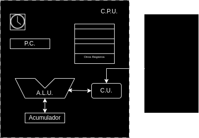
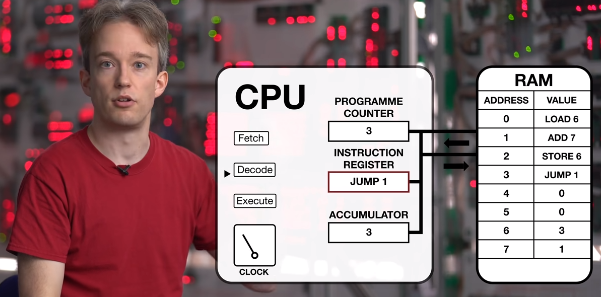

[Volver al inicio](../Readme.md)
# 1.3 Ejecución de Software
Para entender el proceso de ejecución de un programa, deberemos tener al menos una idea básica de cómo está organizada la CPU y su relación con la memoria RAM y el disco del sistema.

- El primer paso será cargar la aplicación, desde su ubicación en el disco duro hasta la memoria RAM para poder ser ejecutada. 
- La Unidad de Control (**C**ontrol **U**nit), irá leyendo de la memoria RAM cada instrucción.
- En caso de ser necesario, la CU puede indicar a la unidad aritmético-lógica (**A**ritmethic **L**ogic **U**nit), que realice las operaciones matemáticas o lógicas pertinentes, una vez termine la operación, la ALU pasará el resultado al registro acumulador.
- El valor del registro del acumulador, puede ser utilizado por la CU en la siguiente instrucción.
- En el contador de programa (**P**rogram **C**ounter), se almacena, en función de la arquitectura, la dirección de memoria de la instrucción en curso o bien la dirección de memoria de la siguiente instrucción a ejecutar.
- Todo el proceso de ejecución va sincronizado con un reloj interno de la CPU. Cada ciclo de reloj se realizará una instrucción.

Un ejemplo del funcionamiento de la CPU está disponible en la siguiente dirección URL: <a href="https://www.youtube.com/watch?v=Z5JC9Ve1sfI" target="_blank">Video de Youtube</a>

(Imagen obtenida de: https://www.youtube.com/watch?v=Z5JC9Ve1sfI)