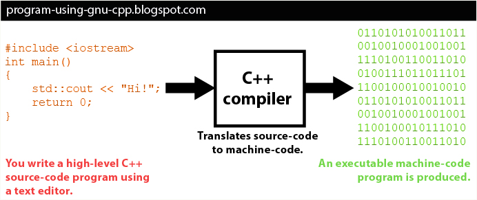

[Volver al inicio](../Readme.md)
# 1.1 Fundamentos de programación
Podemos definir un **Programa** como un conjunto determinado de instrucciones o comandos, pertenecientes a un lenguaje de programación, que se ordenan siguiendo una secuencia concreta, de forma que al ejecutarlo, se obtiene un resultado. Dicho resultado puede afectar al comportamiento o estado físico/lógico de un sistema informático.

Una posible clasificación de los lenguajes de programación podría ser en función de lo cercanos o alejados que puedan estar del lenguaje que entiende el procesador, se denominan **lenguajes de bajo nivel**, aquellos que están más cercanos al lenguaje que entiende la máquina y **lenguajes de alto nivel**, aquellos más cercanos al lenguaje humano.

## Lenguajes de bajo nivel
- Lenguaje máquina: Secuencia compuesta de unos y ceros (sistema binario).

(Imagen obtenida de: https://www.diarlu.com/lenguajes-de-programacion/)

- Lenguaje ensamblador: Se construye a partir de instrucciones que comienzan a ser más entendibles para un humano, aunque se trata de un lenguaje muy dependiente del procesador y complejo a la hora de realizar aplicaciones medianas o grandes.

(Imagen obtenida de: https://www.redbubble.com/es/i/tarjeta-de-felicitacion/C%C3%B3digo-lenguaje-ensamblador-de-Melic93/30331310.5MT14)
## Lenguajes de alto nivel
Los lenguajes de alto nivel tienden a parecerse al lenguaje natural humano y permiten realizar grandes aplicaciones con mucho menor esfuerzo que con los lenguajes de bajo nivel. Otra característica importante de los lenguajes de alto nivel es que son independientes del procesador en el que se use, por lo que facilita la tarea de programación.

Algunos de los lenguajes de alto nivel más conocidos son: C/C++/C#, Java, Python, etc.

Ejemplo de código escrito en Python.

Ejemplo de código escrito en Java.

Tanto el lenguaje ensamblador como cualquiera de alto nivel, al final, deben ser traducidos al lenguaje máquina para que sea entendible por el procesador:

(Imagen obtenida de https://fineproxy.org/es/wiki/assembly-language/)

Ejemplo de un programa realizado en C:

(Imagen obtenida de: https://program-using-gnu-cpp.blogspot.com/p/getting-up-and-running_19.html)
