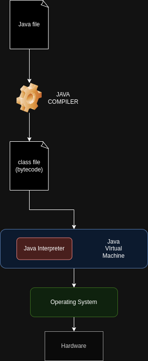

[Volver al inicio](../Readme.md)
# 1.2 Lenguajes de programación interpretados y compilados
En el punto anterior [1.1](../fundamentos/Readme.md) se ha visto una clasificación de los lenguajes de programación en función de lo cercanos que son a la arquitectura del procesador, en este punto, veremos otra clasificación en función de cómo se ejecutan los programas en el procesador.
## 1.2.1 Lenguajes compilados
Los lenguajes compilados son aquellos que, previo a su ejecución, deben ser convertidos al lenguaje máquina correspondiente al hardware en el que está alojado. En el proceso de compilación se detectan errores de sintaxis, entre otros, se enlaza (Linkers) con las respectivas librerías, si procede y posteriormente se crea el fichero ejecutable.
Este tipo de lenguajes tienen la ventaja de ser rápidos y pueden ser optimizados al hardware en el que se ejecutan, por lo que pueden tener un mayor rendimiento.

Por contra, cada modificación en el código requiere una nueva compilación y enlazado. Una de sus virtudes es también uno de sus inconvenientes, ya que al estar adaptado a un hardware concreto, debe ser recompilado (incluso modificado el código) si se pretende que pueda ser utilizado en otro tipo de procesadores. Podríamos decir que los lenguajes compilados son dependientes del hardware en el que son ejecutados.

Ejemplo de un programa realizado en C++:

(Imagen obtenida de: https://program-using-gnu-cpp.blogspot.com/p/getting-up-and-running_19.html)

Como ejemplo de lenguajes compilados tenemos a **C/C++**, entre otros.
## 1.2.2 Lenguajes interpretados
Los lenguajes interpretados podemos entenderlos como un intermediario que va leyendo línea a línea el programa, lo traduce al lenguaje máquina correspondiente y se ejecuta. Esto significa que ante un cambio en el código del programa, no necesita recompilarse, simplemente será interpretado y ejecutado.

Una desventaja de los lenguajes interpretados es que si existe algún error de sintaxis, solo seremos conscientes en el momento de ejecución, salvo que el editor sea capaz de detectarlo. Otro inconveniente atribuido a los lenguajes interpretados es su lentitud, aunque con los compiladores **JIT (Just In Time)** se ha conseguido disminuir la diferencia de velocidad entre lenguajes compilados e interpretados.

Una ventaja de los lenguajes interpretados es que son independientes del hardware en el que se ejecutan y es tarea del intérprete, realizar la traducción al procesador, por lo que los programadores pueden abstraerse de los detalles de hardware a la hora de codificar.

Como ejemplo de lenguajes interpretados tenemos a PHP y Javascript, entre otros.
## 1.2.3 Lenguajes mixtos
Dentro de este conjunto de lenguajes, podríamos destacar a 'Java'. El lenguaje Java fue creado para utilizarse de forma universal sin necesidad de preocuparse por el hardware subyacente. La idea es utilizar un lenguaje común, que se **_compila_** a un código intermedio (bytecode, normalmente un fichero class). Este código intermedio es leído por la máquina virtual de Java y se convierte en tiempo de ejecución (se **_interpreta_**) al lenguaje concreto de cada procesador. Esto significa que cada sistema operativo dispone de una máquina virtual de Java que es capaz de interpretar los bytecodes y convertirlos al lenguaje máquina de la arquitectura concreta sobre la que opera.

`NOTA 1: Aunque Python se suele considerar como un lenguaje interpretado, cabe decir que también puede entrar dentro de la clasificación de lenguajes mixtos, ya que cuando importamos un fichero py dentro de otro fichero, este se puede compilar (con extensión .pyc) y permite una mayor velocidad de ejecución.`

`NOTA 2: Existen otras clasificaciones de los lenguajes, por ejemplo, en función del paradigma de programación al que pertenecen. Hablamos en este caso de los lenguajes procedimentales o imperativos (como C), lenguajes orientados a objetos (Java, PHP, Python), declarativos (SQL) y Funcionales (LISP).`