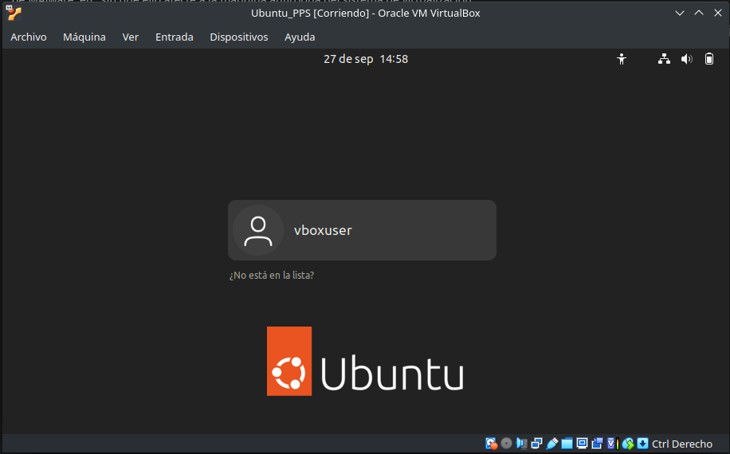
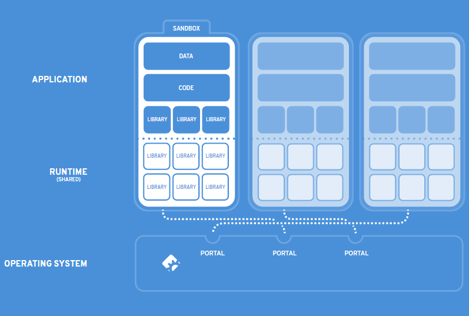

[Volver al inicio](../Readme.md)
# 1.6 Seguridad en los lenguajes de programación y sus entornos de ejecución (Sandboxes)
Podemos entender una SandBox (caja de arena), como una herramienta que permite realizar pruebas de código sin que estas pruebas puedan afectar a la seguridad del sistema anfitrión. También se pueden utilizar para estudiar el efecto de diferentes tipos de **MALWARE** sin peligro de ser infectados.

## Virtualización
Un ejemplo de SandBoxes pueden ser las herramientas utilizadas para la virtualización (VirtualBox, VMWare, etc.), ya que, con una correcta configuración de la red, nos van a permitir ejecutar cualquier tipo de software, pruebas de Malware, etc. sin que ello afecte a la máquina anfitriona del sistema de virtualización.

## SandBox para código
Existen, no obstante, otros ejemplos de SandBoxes más centrados en la ejecución de programas, que se pueden encontrar en línea. Un ejemplo que se mostrado en anteriores entradas, són los editores de código para Python, que permiten escribir y probar programas sin perjuicio para el entorno del desarrollador/a:

* https://pythonsandbox.dev/?file=main.py
* https://pythonsandbox.com/
* https://www.tutorialspoint.com/compile_c_online.php (SandBox para programación en C)
* https://cpp.sh/ (Específico para C++)
* https://www.programiz.com/python-programming/online-compiler/ (SandBox para diversos lenguajes Python, Java, C/C++/C#, Javascript, PHP, Go, ...)
* https://codepen.io/marcysutton/pen/ZYqjPj (Para entornos web)
## PAYPAL SandBox
Un ejemplo interesante de SandBox es **Paypal SandBox**, con el que se permite realizar pruebas de pasarelas de pago de PayPal sin correr riesgos [Enlace](https://developer.paypal.com/home).

## Windows (SandBoxie)
Sobre entornos Windows, también existe otra herramienta llamada **Sandboxie** que permite la instalación de aplicaciones sin que exista riesgo para la máquina anfitriona, sin necesidad de instalar una máquina virtual, que suele ser más exigente en cuanto a requerimientos software y hardware [Enlace](https://github.com/sandboxie-plus/Sandboxie).

## Linux (Flatpak)
En entornos GNU/Linux, existe un formato de paquetes llamado **Flatpak** que permite realizar una SandBox aislada del resto del sistema, llamada BubbleWrap. Cada aplicación se encapsula dentro de una SandBox en la que están las librerías necesarias y el **RunTime** que es el entorno de ejecución de la aplicación, cualquier acceso fuera de la SandBox debe ser autorizado explicitamente. 

(Imagen obtenida de: https://www.tomshardware.com/news/flatpack-universal-linux-packaging-format,32137.html)