[Volver al inicio](../Readme.md)
# 1.5 Tipos de pruebas
Una clasificación de los tipos de pruebas podría ser la siguiente:

- Pruebas **unitarias**: Se realizan pruebas de cada parte del código por separado, por ejemplo de un módulo, una función, etc.
- Pruebas de **integración**: Una vez probadas las partes de código de forma independiente, necesitamos comprobar que al relacionarse entre ellas, el funcionamiento es el correcto. Por ejemplo, que los valores de salida de un módulo, son los adecuados para la entrada de otro.
- Pruebas de **validación**: Previo al lanzamiento en público de la aplicación, se necesita evaluar que el producto, en su conjunto, funciona adecuadamente y en base  a las especificaciones.
- Pruebas del **sistema**: Se comprueba el nivel de seguridad, se realizan pruebas de rendimiento y de resistencia frente a situaciones anormales.
- Pruebas de **aceptación**: En este punto, es el/la usuario/a quien realiza las pruebas para comprobar que se adapta a sus necesidades y que cumple las especificaciones dadas durante la contratación del servicio.

Una de las tendencias actuales en el desarrollo de Software, es el desarrollo en **espiral**, en el que se van intercalando las distintas pruebas según se va avanzando en el desarrollo completo de la aplicación, trabajando con **Prototipos** no completamente funcionales, para que el cliente pueda ver la evolución sin riesgo de sorpresa desagradable, una vez se ha desarrollado por completo la aplicación:


(Imagen obtenida de: https://es.wikipedia.org/wiki/Desarrollo_en_espiral)

## ¿Por qué realizar pruebas?
Una de las principales razones para realizar pruebas a un producto Software, es la de asegurar que dicho producto cumple las especificaciones para las que fue creado y que, durante su utilización, se mantiene en un estado _**robusto**_ y sin errores.

Otra razón no menos importante y relacionada con la anterior, es la de asegurar que dicho software no nos lleva a un estado que pueda ser aprovechado por un ciberdelincuente para realizar algún tipo de ataque. Hablamos desde una denegación de servicio, conocido como DoS (**D**enial **o**f **S**ervice), a por ejemplo, la obtención de una Shell con permisos de administrador debido a un ataque Buffer Overflow, por poner un par de casos.

## 1.5.1 Pruebas de caja blanca
Se trata de un tipo de pruebas _**unitarias**_. Se caracteriza por tener acceso completo al código a evaluar, se debe garantizar que:
- Se pasa por todos los caminos independientes.
- Se ejecutan todas las sentencias.
- Se toman todas las decisiones lógicas (V/F).
- Se prueban los bucles en todos sus límites.

Existen herramientas que nos permitirán conocer qué porcentaje de cobertura tienen nuestras pruebas. El éxito o fracaso depende mucho del _banco de pruebas_ utilizado para probar las aplicaciones, no solo el porcentaje de cobertura es importante, también los valores de prueba.

### Prueba del camino básico. Representación de grafos.
Se trata de un tipo de prueba adecuado para los algoritmos más sencillos, nos ayudaremos de grafos para determinar los posibles caminos que se deben evaluar. Este tipo de prueba nos permitirá calcular la **COMPLEJIDAD CICLOMÁTICA**.

Según el tipo de estructura de código, le corresponderá un tipo de grafo, se enumeran a continuación las más básicas:

- #### Secuencia
Indica la ejecución de forma ordenada de las acciones.

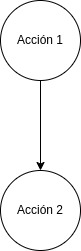

- #### Decisión (IF-ELSE)
Si se cumple una condición, se realizan una o más acciones, en caso contrario, se realizan otras condiciones (o ninguna).

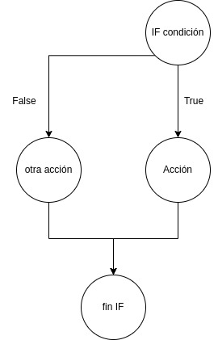

- #### Bucle While
Se evalua primero la condición y mientras se cumpla, se realizan las acciones indicadas, una vez deja de cumplirse la condición, se sale del bucle y continua el flujo del programa

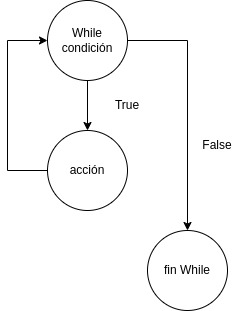
- #### Bucle Do-While
Realiza un bucle que se repite mientras se cumpla la condición, con una característica, siempre se ejecuta al menos una acción aunque la condición no se cumpla.

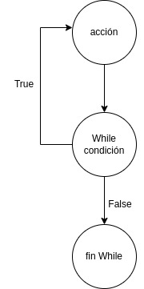

> NOTA: En el diagrama de grafos, a los nodos que contienen una decisión se les llama **nodos predicado** y a las líneas que unen los nodos, **aristas**.

### Prueba del camino básico
Dado un algoritmo, deberemos preparar las pruebas de forma que se ejecuten todos los caminos posibles, o **caminos básicos**. En función de la cantidad de caminos posibles, el proceso de prueba será más o menos complejo. Para determinar la complejidad del algoritmo y determinar sus caminos básicos, utilizaremos la _**COMPLEJIDAD CICLOMÁTICA**_.

La complejidad ciclomática (CC) se calcula de diferentes formas:

```
CC = Número_de_aristas - número_de_nodos + 2

CC = Número_nodos_predicado + 1

CC = Número_de_zonas
```

En función de la complejidad ciclomática, determinaremos la evaluación del riesgo del algoritmo

Complejidad Ciclomática|Evaluación del riesgo del algoritmo
--|--
1 - 10|Algoritmo simple. Poco riesgo
11 - 20|Algoritmo complejidad media. Riesgo moderado
21 - 50|Algoritmo complejo. Alto riesgo
\> 50|Algoritmo no testeable. Muy alto riesgo

Para entender mejor este cálculo, se muestra un ejemplo:

Sumar los N números naturales. Dado un número natural como entrada (0, 1, 2, ....), realizar un algoritmo que sume dicho número y los naturales inferiores hasta 0. Por ejemplo, si nos pasan como entrada el número 4, tendremos **4 + 3 + 2 + 1 + 0 = 10**.

El diagrama de flujo podría ser parecido a este:

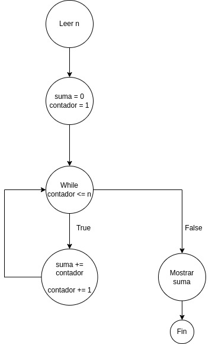

Y la traza del programa, para un valor de 4 sería:

n | suma | contador
--|--|--
4|0|1
 "|1|2
 "|3|3
 "|6|4
 "|10|5


Realizamos el cálculo:
- Número de nodos = 6
- número de aristas = 6
- Número de nodos predicado = 1

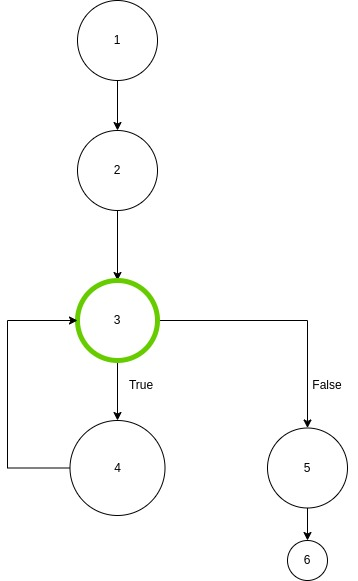

Así pues, las fórmulas anteriores con los valores serían:

- CC = Número_de_aristas - número_de_nodos + 2 = 6 - 6 + 2 = **2**
- CC = Número_nodos_predicado + 1 = 1 + 1 = **2**
- CC = Número_de_zonas = **2**

Nos falta ver el número de zonas para ver si se cumplen todas las fórmulas...

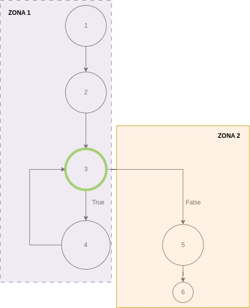

Los caminos básicos son:

- Camino 1: **1-2-3-5-6**
- Camino 2: **1-2-3-4-3-5-6**

## 1.5.2 Ejemplo de pruebas con Python y "UnitTest"

Una vez diseñado el algoritmo, debemos codificarlo y realizar pruebas de funcionamiento. En Python existen diferentes opciones, de las cuales, las más conocidas son **PyTest** y **UnitTest**.
En nuestro caso, vamos a realizar las pruebas con **UnitTest**, para ello, crearemos una clase de prueba en un fichero de pruebas, independiente del programa a probar y llamaremos a la librería mediante un "import".

> import unittest

El fichero de pruebas deberá disponer de una clase que heredará de **unittest.TestCase**. Para realizar las pruebas, utilizaremos el fichero a probar, realizando llamadas a este desde la clase de pruebas y utilizando algunas de las siguientes sentencias:

- .assertEqual(x, y): Verifica que x e y son iguales.
- .assertTrue(x): Verifica que el valor de x es True.
- .assertFalse(x): Verifica que el valor de x es False.
- .assertRaises(x): Verifica que se genera una excepción.

> Existen otras sentencias de prueba a utilizar como .assertIs(), .assertIn(), etc. (consultar la bibliografía de este capítulo).

Para entender el funcionamiento, mejor un ejemplo, para ello, vamos a realizar un algoritmo que, dados 3 números enteros, determina cual de los 3 es el **mayor**.

El diagrama de flujo (sin optimizar) podría ser este:

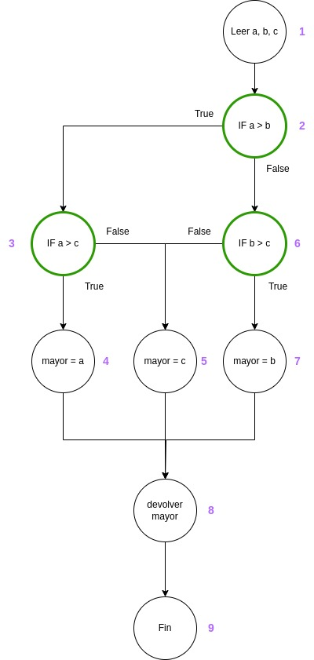

En el que se observan 3 nodos **predicado** y por lo tanto, una complejidad ciclomática de 4 (3 nodos predicado + 1).

Un código en Python que refleje el diagrama de flujo sería (mayor_de_tres.py):

```Python
def devuelve_mayor(a, b, c):
    if a > b:
        if a > c:
            mayor = a
        else:
            mayor = c
    else:
        if b > c:
            mayor = b
        else:
            mayor = c
    return mayor 
```

El código para ejecutar las pruebas sería:

```Python
import unittest
from mayor_de_tres import devuelve_mayor

class TestMayorDeTres(unittest.TestCase):
    def test_mayor(self):
        self.assertEqual(devuelve_mayor(12, -3, 9), 12)

    def test_mayor2(self):
        self.assertEqual(devuelve_mayor(-12, -3, 0), 0)

    def test_mayor3(self):
        self.assertEqual(devuelve_mayor(-12, -3, -1), -1)

    def test_mayor4(self):
        self.assertIsNot(devuelve_mayor(-12, -3, -1), -12)

    def test_mayor5(self):
        self.assertEqual(devuelve_mayor(8, 15, 1), 15)

if __name__ == '__main__':
    unittest.main()
```

Si ejecutamos las pruebas en Visual Studio Code, obtenemos el siguiente resultado:

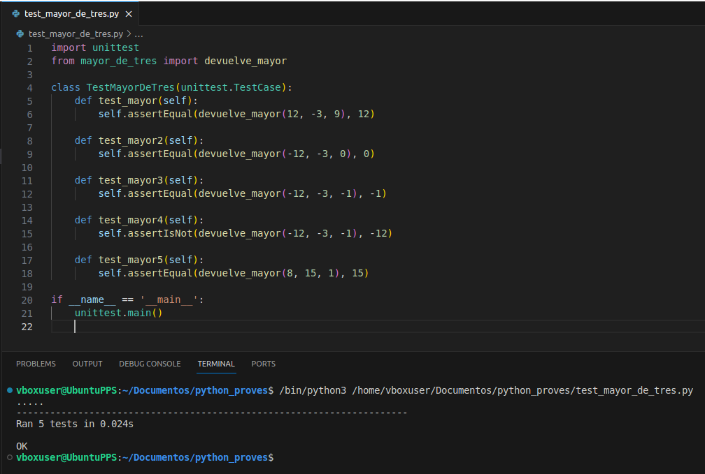

Imaginemos que forzamos un error en el test número 5 y en lugar de decir que esperamos un resultado de 15, decimos que esperamos un 8. Nos indicará que el resultado que esperamos (8), no coincide con el valor que devuelve la función para los datos que se pasan (15):

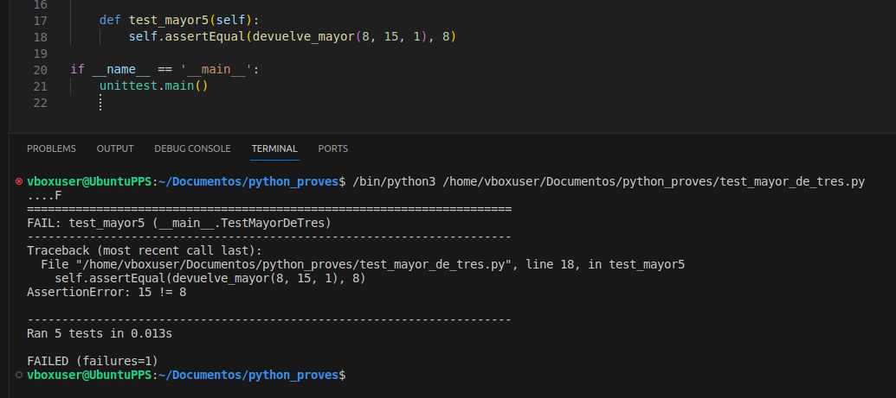

Podemos utilizar **.assertFalse** para verificar que una comparación no va a ser cierta, o visto desde otro punto de vista, que la siguiente afirmación es falsa:

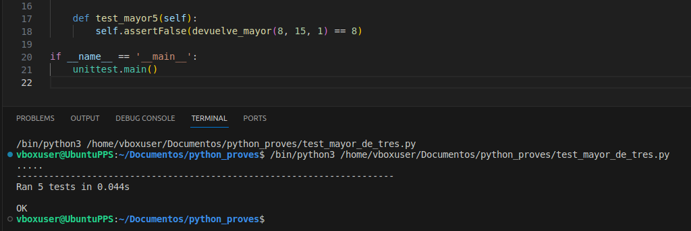

## 1.5.3 Cobertura de las pruebas

Aunque gracias a nuestra intuición y buen hacer, podemos crear un buen banco de pruebas, es posible que alguna de las ramas del algoritmo quede sin probar, con el correspondiente peligro que esto supone. Una forma de medir la **cobertura** de nuestro banco de pruebas sobre el código, es utilizando herramientas externas que nos muestren esto de forma gráfica. Para ello vamos a utilizar **COVERAGE**.

Para trabajar de forma independiente y poder instalar librerías sin que afecte al sistema anfitrión, trabajaremos sobre entornos virtuales Python. El primer paso será instalar pipx:

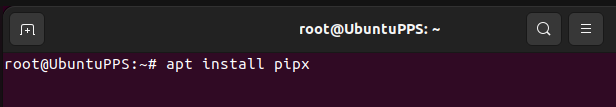

Una vez pipx instalado, lo utilizaremos para instalar el entorno virtual de Python "**virtualenv**":

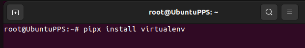

Ahora lo correcto, sería crear una carpeta para el proyecto en el que vamos a trabajar, y crear también el entorno virtual de ese proyecto (normalmente, por convención se llama venv al entorno virtual, aunque puede tener otro nombre, en este caso, se crea como carpeta oculta **.venv**):

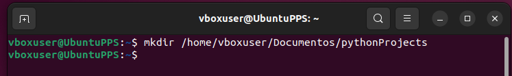

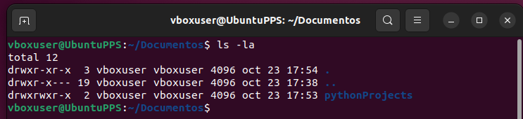

Dentro del proyecto de trabajo se crea el entorno virtual .venv utilizando la palabra clave "**venv**":

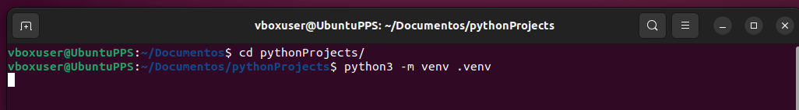

Si observamos, dentro de la carpeta .venv se han creado diferentes ficheros y subcarpetas que contienen el entorno virtual de Python y el que se podrán añadir las librerías que se necesiten, sin afectar al sistema anfitrión:


El entorno virtual se debe activar para que entre en funcionamiento, aparece el prefijo (.venv) indicando que se ha activado:

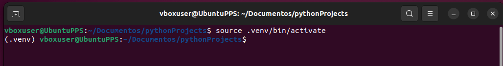

Y se desactiva con "**deactivate**":

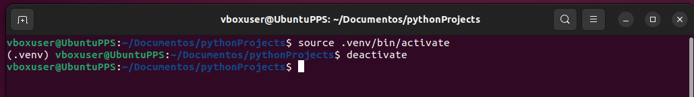

No obstante, también puede ser activado directamente desde Visual Studio Code (botón derecho del ratón sobre la zona marcada en rojo):

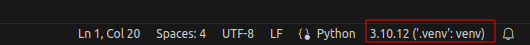

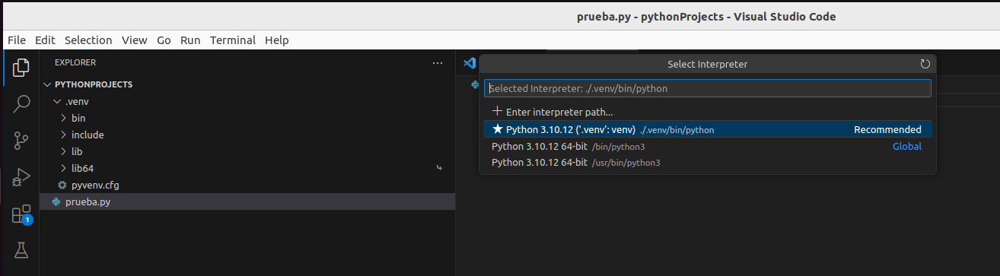

Una vez activado el entorno virtual, instalaremos la libreria coverage dentro de este haciendo:

> pip install coverage

Una vez instalado, lo llamaremos para que realice las pruebas mediante:

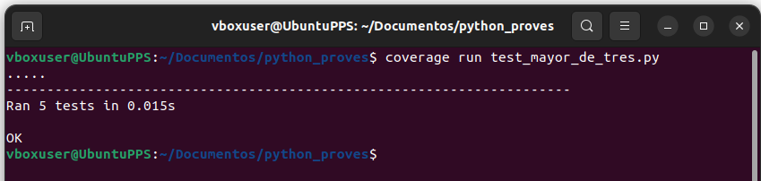

Una vez realizadas las pruebas mediante Coverage, crearemos un fichero XML que podrá ser utilizado, por ejemplo en Visual Studio Code y otro HTML (opcional), si queremos que se nos muestre en una página web como documentación.

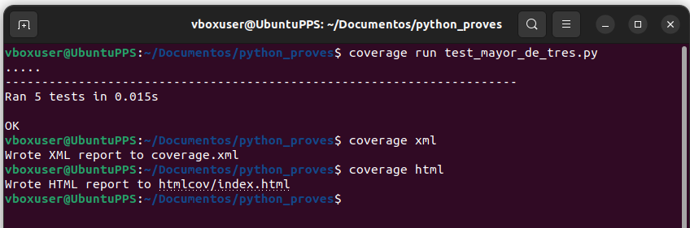

Los resultados con los porcentajes se muestran a continuación (HTML):

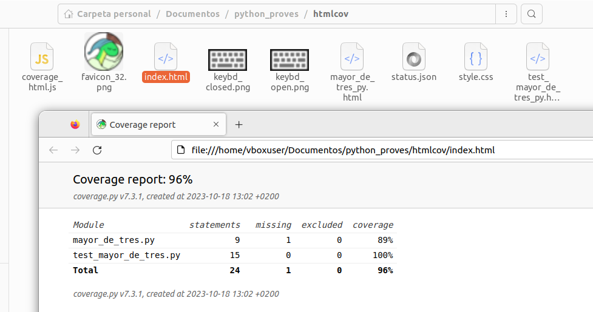

Como se puede observar, la línea 6 nunca se ejecuta con el banco de pruebas que hemos elegido:

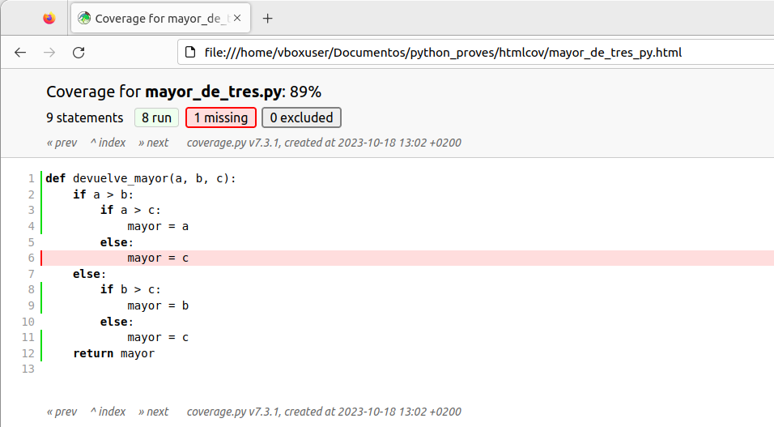

Otra forma alternativa al formato HTML, sería utilizando un plugin para Visual Studio Code, este plugin se apoya en el XML que generamos con la orden **coverage xml** vista anteriormente:

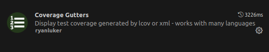

Que nos ofrece una forma alternativa (revisa el pie de pantalla para ver el porcentaje de cobertura):

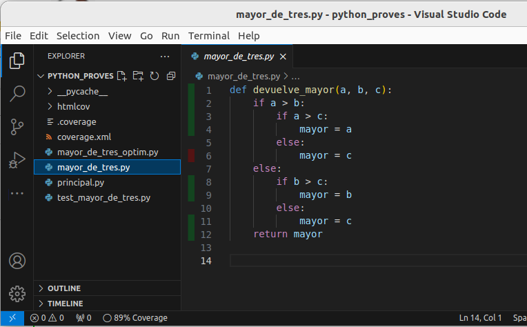

> NOTA: Cada vez que se modifica el código, se debe ejecutar de nuevo las sentencias:
> - coverage run fichero.py
> - coverage html
> - coverage xml


## 1.5.4 Pruebas de caja negra


