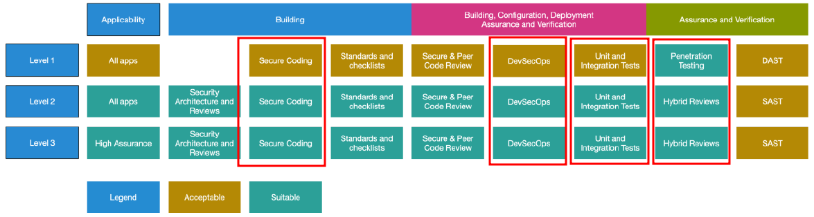
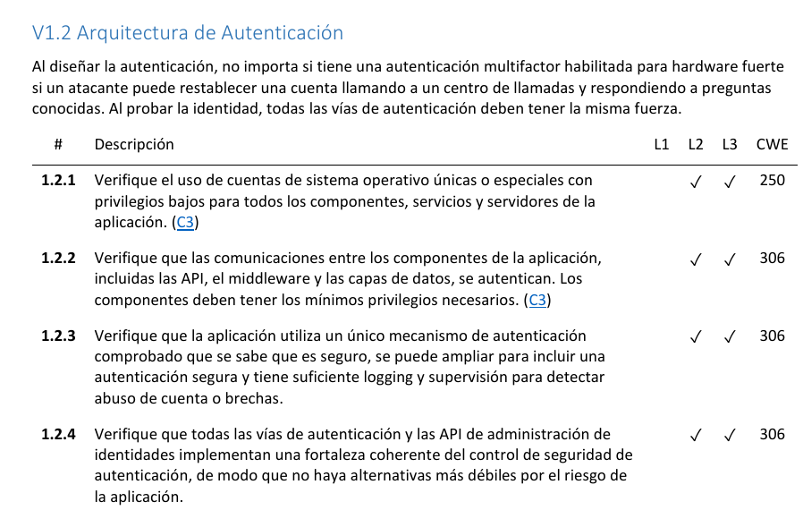

[Volver al inicio](../Readme.md)
# 2.3 Requisitos de verificación necesarios asociados al nivel de seguridad establecido
## 2.3.1 Requisitos de verificación
OWASP define como requisitos de verificación los que se enumeran a continuación:
- Ciclo de Vida de Desarrollo de Software Seguro
- Arquitectura de Autenticación
- Arquitectura de Gestión de Sesiones
- Arquitectura de Control de Acceso
- Arquitectura de Entradas y Salidas
- Arquitectura Criptográfica
- Arquitectura de Errores, Logging y Auditoría
- Arquitectura de Protección de Datos y Privacidad
- Arquitectura de Comunicaciones
- Arquitectura de Software Malicioso
- Arquitectura de la Lógica de Negocio
- Arquitectura de Carga Segura de Archivos
- Arquitectura de API
- Arquitectura de Configuración

## 2.3.2 Comprobaciones de seguridad a nivel de aplicación: ASVS (Application Security Verification Standard)
Otro de los recursos importantes que nos ofrece el proyecto OWASP, es el **OWASP ASVS (Application Security Verification Standard)** [<a href="https://owasp.org/www-project-application-security-verification-standard/" target="_blank">Enlace</a>].

ASVS nos permite disponer de una importante base para la comprobación de controles técnicos de seguridad en los desarrollos de aplicaciones web. Podemos verlo como una lista de requisitos que se deberían cumplir para ofrecer aplicaciones web seguras en base a unos **estándares abiertos**.

El estándar, está disponible para su descarga en PDF en diferentes idiomas. Una traducción al castellano la podemos encontrar <a href="https://github.com/OWASP/ASVS/raw/v4.0.3/4.0/OWASP%20Application%20Security%20Verification%20Standard%204.0.3-es.pdf" target="_blank">aquí</a>.

Como indica en el propio documento, ASVS tiene dos objetivos principales:

- "Ayudar a las organizaciones a desarrollar y mantener aplicaciones seguras".
- "Permitir que los proveedores de servicios de seguridad, los proveedores de herramientas de seguridad y los consumidores alineen sus requisitos y ofertas".

Como se puede comprobar, ASVS define tres niveles de verificación de seguridad:

- Nivel 1: Debería aplicarse en TODAS las aplicaciones web, permite un grado **BÁSICO** de seguridad.
- Nivel 2: Recomendable en aplicaciones que contienen "**DATOS CONFIDENCIALES**" que necesitan protección (Administraciones Públicas, etc.).
- Nivel 3: Recomendado para aquellas aplicaciones "**CRÍTICAS**" que realizan transacciones de alto valor (bancos), contienen datos médicos sensibles (hospitales) u otras aplicaciones (Centrales nucleares, por ejemplo).

Todos los niveles de ASVS disponen de un apartado relacionado con la seguridad:

Imagen obtenida de https://github.com/OWASP/ASVS/raw/v4.0.3/4.0/OWASP%20Application%20Security%20Verification%20Standard%204.0.3-es.pdf

NOTA IMPORTANTE:

Tal como se indica en el documento ASVS "El nivel 1 (L1) es el único nivel que es completamente comprobable de penetración usando humanos. Todos los demás requieren acceso a la documentación, el código fuente, la configuración y las personas involucradas en el proceso de desarrollo".

Una muestra de la guía ASVS, se puede observar a continuación:

