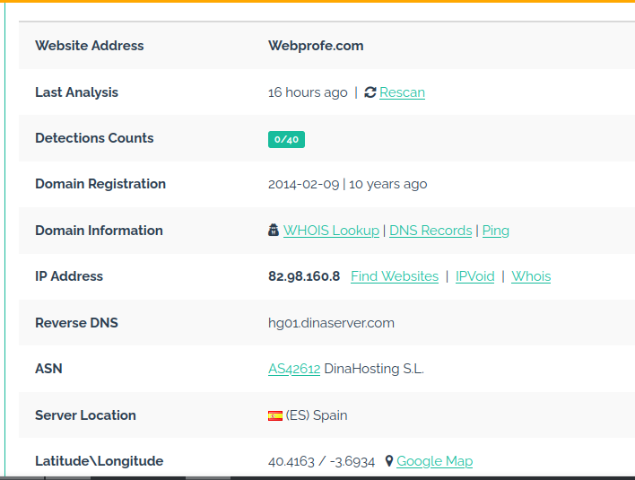
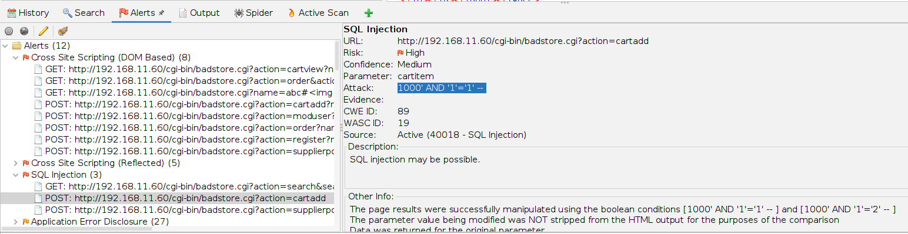

 [Volver al inicio](../Readme.md)
  # Unidad 3 - Detección y corrección de vulnerabilidades de aplicaciones web
  ## Resultados de aprendizaje y criterios de evaluación
  3. Detecta y corrige vulnerabilidades de aplicaciones web analizando su código fuente y configurando servidores web.
  - Se han validado las entradas de los usuarios.
  - Se han detectado riesgos de inyección tanto en el servidor como en el cliente.
  - Se ha gestionado correctamente la sesión del usuario durante el uso de la
aplicación.
- Se ha hecho uso de roles para el control de acceso.
- Se han utilizado algoritmos criptográficos seguros para almacenar las
contraseñas de usuario.
- Se han configurado servidores web para reducir el riesgo de sufrir ataques
conocidos.
- Se han incorporado medidas para evitar los ataques a contraseñas, envío
masivo de mensajes o registros de usuarios a través de programas automáticos
(bots).
  ## 3.1 Tipos de vulnerabilidades
  - [IDOR](idor/Readme.md)
  - [LFI](lfi/Readme.md) 
  - [RFI](rfi/Readme.md)
  - [CSRF](csrf/Readme.md)
  - [SSRF](SSRF/Readme.md)
  ## 3.2 Herramientas de detección
  En función de la necesidad, podemos encontrar herramientas que nos ofrecen una variedad importante de información sobre el sitio web que queremos analizar.

  ### 3.2.1 Obtener información de la IP/Dominio
  - DomainTools (https://whois.domaintools.com)
  - IPChecker (https://ipinfo.info/html/ip_checker.php)
  - IPinfo.io (https://ipinfo.io/)
  - URLVoid para verificar reputación (https://www.urlvoid.com/)

  Ejemplo de DomainTools: 

  

  Ejemplo de URLVoid:

  

  

  ### 3.2.2 Plugins de navegador. Wappalyzer.
  **Wappalyzer** es una plugin para diferentes navegadores que nos permite conocer de forma muy fácil las tecnologías utilizadas en un sitio web, dependiendo claro está, de las protecciones que este ofrezca. Se puede ver un ejemplo a continuación:
  

  ### 3.2.3 Herramientas de terceros
  #### Nikto
  Nikto permite reconocer diferentes aspectos del sitio web analizado, como la tecnología del servidor, configuraciones de protección, directorios interesantes...

  

  #### Whatweb
  Herramienta que detecta las tecnologías utilizadas en el sitio web:

  

  #### Wig
  Una herramienta parecida a **Whatweb** que nos ofrece resultados parecidos pero en otro formato:

  

  #### Dirb
  Esta herramienta, denominada **web fuzzer**, nos permite detectar carpetas y subcarpetas de un sitio web, en base a wordlists que podemos seleccionar en /usr/share/dirb/wordlists.

  

  #### Dirbuster
  Herramienta similar a **Dirb** pero con interfaz gráfica. Esta herramienta se puede configurar para que trabaje conjuntamente con **BurpSuite**, indicando que pase por el proxy, de forma que los directorios que vaya encontrando, se le pasen a BurpSuite y puedan ser analizados.

  En esta primera captura se puede ver la configuración de la wordlist:

  

  Dirbuster nos va mostrando las pruebas realizadas y si han tenido o no éxito:

  

  Una muestra de como configurar el proxy para que pase a través de BurpSuite:

  

  #### Gobuster
  Una herramienta a tener en cuenta para la detección de carpetas y subcarpetas (en esta captura se ayuda de la wordlist de Dirbuster):

  

  ### Detección de vulnerabilidades web
  #### ZAP (Zed Attack Proxy)
  Se trata de un escaner de vulnerabilidades y proxy web gratuito (https://www.zaproxy.org/), ampliamente utilizado en la detección de vulnerabilidades web.

  

  

