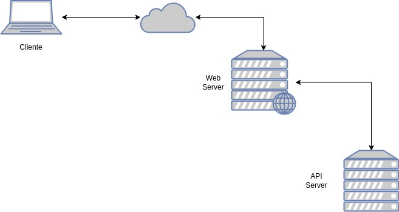

[Volver al inicio](../Readme.md)
# SSRF (Server Side Request Forgery)
## Introducción.
En múltiples aplicaciones, un servidor puede necesitar del acceso a diversos datos que son servidos mediante APIs, estas APIS, pueden ser remotas o locales. En muchas ocasiones, el acceso a las APIs es privado, por lo que un atacante no puede acceder directamente, pero sí son accesibles a través de servidores autorizados.
La idea del ataque, es aprovechar servidores vulnerables a SSRF para poder acceder a través de ellos a zonas internas de los servidores de APIs y así poder exfiltrar información sensible, entre otras acciones.



## ¿Cómo se realiza el ataque?
Analizando las peticiones al servidor, se observa cómo externaliza la petición de datos hacia otro recurso (por ejemplo, una API):

```
POST /stock HTTP/1.0
Content-Type: application/x-www-form-urlencoded

stockApi=http://10.25.12.134/check/productId=1
```

Como se ha comentado anteriormente, un atacante no tiene acceso a la API, pero si el servidor es vulnerable a SSRF, se puede modificar la petición para obtener datos confidenciales, aprovechando que la petición viene desde el propio servidor y no desde la máquina del atacante.

```
POST /stock HTTP/1.0
Content-Type: application/x-www-form-urlencoded

stockApi=http://10.25.12.134/getData/admin-credentials
```

## Formas de prevenir un ataque SSRF
- Deshabilitar las redirecciones.
- Habilitar el uso de Whitelist para limitar los dominios aceptados.
- Exigir autenticación sobre todos los servicios habilitados.
- Monitorización del tráfico para detectar fugas de información.
## Bibliografía
- Snyk Learn. (s.f.). Server-side request forgery (SSRF). https://learn.snyk.io/lesson/ssrf-server-side-request-forgery/
- PortSwigger (s.f.). Server-side request forgery (SSRF). https://portswigger.net/web-security/ssrf
- Eoftedal. (s.f.). Server Side Request Forgery. https://owasp.org/www-community/attacks/Server_Side_Request_Forgery
- Intigriti. (s.f.). Server-Side Request Forgery (SSRF). https://blog.intigriti.com/hackademy/server-side-request-forgery-ssrf/?cn-reloaded=1
- Pagliaro, L. (s.f.). Qué es SSRF (Server Side Request Forgery) y cómo se soluciona. Hackmetrix. https://blog.hackmetrix.com/ssrf-server-side-request-forgery/
- OWASP. (s.f.). A10:2021 – Falsificación de Solicitudes del Lado del Servidor (SSRF). https://owasp.org/Top10/es/A10_2021-Server-Side_Request_Forgery_%28SSRF%29/
