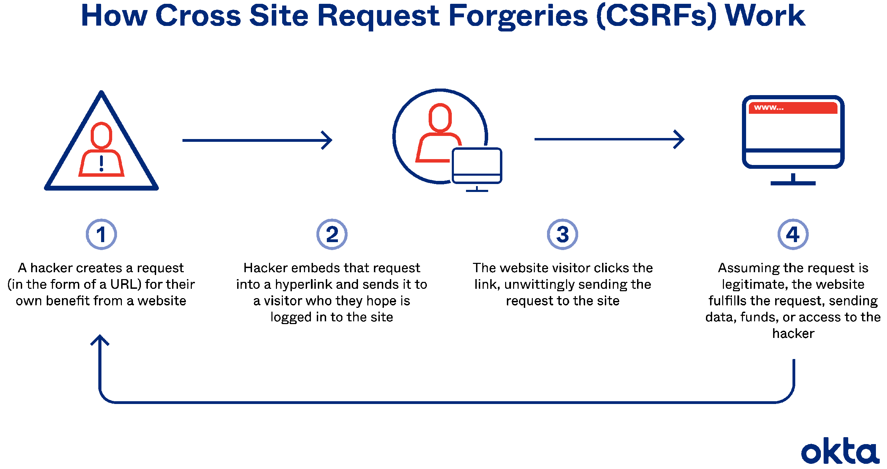

[Volver al inicio](../Readme.md)
# CSRF (Cross Site Request Forgery)
## Introducción.
Muchas aplicaciones web utilizan algún método de autenticación para poder realizar operaciones sensibles/críticas tales como modificar la contraseña de acceso, cambio de correo electrónico, etc. Esta autenticación es a menudo realizada en base a sesiones de usuario, de forma que una vez autenticado, se genera una cookie que se almacena en el equipo de dicho usuario. El identificador de sesión que se guarda en la cookie, será enviado en cada una de las transacciones que se realicen en esa aplicación web.

De forma adicional, debemos saber que cuando nos conectamos a un sitio web, algunos de los recursos que utiliza, son cargados desde otro sitio, ya sean imágenes, fuentes de texto, etc. Esto significa que cuando nos logueamos en un sitio web, tanto las peticiones que nosotros realizamos como las que se utilizan para cargar los diferentes recursos del sitio web, van acompañadas de nuestro identificador de sesión. Esta particularidad, ayuda a que se consiga el ataque mediante CSRF.
No obstante, se necesitan algunas condiciones adicionales para que el ataque mediante CSRF sea efectivo.
## ¿Qué condiciones se deben cumplir para que el ataque tenga éxito?
- Evidentemente, el sitio debe ser vulnerable a CSRF.
- Utilizar estrategias de Phishing para engañar a la víctima.
- Se debe realizar una acción relevante, tal como cambiar la contraseña o modificar el correo electrónico.
- Que el sitio web gestione las sesiones en base a cookies y que la víctima esté logueada.
- Que el sitio web tenga una política de cookies "**SameSite**" débil.
- Que al realizar una acción relevante, como el cambio de contraseña, **NO se exija** algún dato impredecible (por ejemplo, que no se exija la contraseña actual).
## ¿Cómo funciona el ataque?


Imagen obtenida de https://www.okta.com/identity-101/csrf-attack/

En primer lugar, el atacante debe estudiar el funcionamiento del sitio web para entender cómo se realizan las peticiones y asegurarse de que es vulnerable a CSRF.

Imaginemos que el sitio vulnerable utiliza una petición como la que se muestra a continuación para el cambio de correo electrónico (en este caso en formato GET para que se entienda mejor académicamente):

`https://sitiovulnerable.com/email/cambiar?email=usuarioLegitimo@sitiovulnerable.com`

Una muestra de la misma petición en formato POST sería:
```
POST /email/change HTTP/1.1
Host: sitiovulnerable.com
Content-Type: application/x-www-form-urlencoded
Content-Length: 40
Cookie: session=Merdf56yhujTFer612gvh8UjleursRgB

email=usuarioLegitimo@sitiovulnerable.com
```
El atacante debe engañar a la víctima mediante alguna estrategia de Phishing, simulando una notificación de la página web legítima, de forma que lo lleve a pulsar sobre un enlace que lo lleve a un sitio web fraudulento, realice una transacción oculta no deseada por la víctima y que beneficiará de alguna manera al atacante.

El HTML del sitio web falso podría ser así:
```html
<html>
    <body>
        <form action="https://sitiovulnerable.com/email/change" method="POST">
            <input type="hidden" name="email" value="atacante@baddomain.net" />
        </form>
        <script>
            document.forms[0].submit();
        </script>
    </body>
</html>
```
La petición HTTP generada, debido a la política débil de cookies SameSite, incluiría la cookie de usuario, aunque la petición solicitada por el atacante no pertenece a la web del sitio legítimo:
```
POST /email/change HTTP/1.1
Host: sitiovulnerable.com
Content-Type: application/x-www-form-urlencoded
Content-Length: 40
Cookie: session=Merdf56yhujTFer612gvh8UjleursRgB

email=atacante@baddomain.net
```
Lo que se ha conseguido es, mediante la sesión de usuario legítimo, modificar su propio correo, de forma que el atacante puede pedir un cambio de contraseña y cuando el sitio web envíe la petición por correo, no la enviará al usuario legítimo, sino al atacante, que podrá suplantar al usuario legítimo y realizar acciones en su nombre. Si el usuario es un administrador del sistema, el problema sería mucho más grave.
## Formas de prevenir un ataque CSRF
- Utilizar tokens anti-CSRF en lugar de cookies de sesión. El token será un valor **impredecible**, **aleatorio**, generado en el lado del servidor, por lo que el atacante, no podrá preveerlo para preparar una petición HTTP. Este token se suele enviar desde el servidor en un campo oculto del formulario HTML.
- Adoptar una política de cookies SameSite fuerte, de forma que el atacante no pueda incluir sus peticiones junto a las legítimas del sitio web objetivo.
- Realizar una nueva petición de autenticación para realizar las acciones más críticas, como el cambio de contraseña, transferir dinero, etc.
- Exigir datos impredecibles para el atacante, como por ejemplo, pedir la contraseña actual para realizar una cambio de contraseña.

## Bibliografía.
- PortSwigger. (s.f.). Cross-site request forgery (CSRF). https://portswigger.net/web-security/csrf
- Snyk Learn. (s.f.). Cross site request forgery (CSRF). https://learn.snyk.io/lesson/csrf-attack/
- KirstenS. (s.f.). Cross Site Request Forgery (CSRF). https://owasp.org/www-community/attacks/csrf
- Moradov, O. (27/04/2022). 3 Simple CSRF Examples: Understand CSRF Once and For All. Bright. https://brightsec.com/blog/csrf-example/
- Imperva. (s.f.). Cross site request forgery (CSRF) attack. https://www.imperva.com/learn/application-security/csrf-cross-site-request-forgery/
- Ranjan, R. (27/08/2022). Cross site request forgery (CSRF) attack. Medium. https://medium.com/@rajeevranjancom/cross-site-request-forgery-csrf-attack-6949edb9e405
- Andrzej Nidecki, T. (s.f.). Cross-site request forgery (CSRF). Invicti. https://www.invicti.com/learn/cross-site-request-forgery-csrf/
