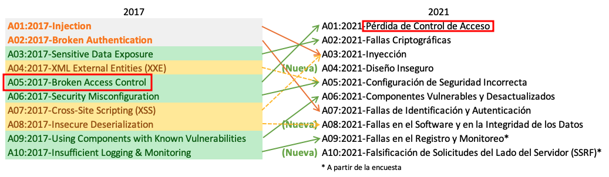
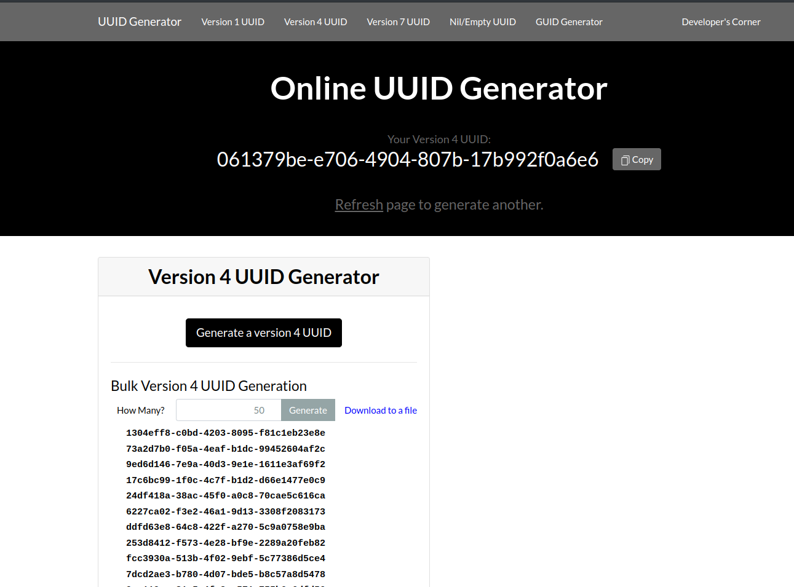

[Volver al inicio](../Readme.md)
# IDOR (Insecure Direct Object Reference)

## Introducción.
**IDOR** o la _referencia directa a objetos de forma insegura_, es una vulnerabilidad derivada de una falta de control, en el acceso a recursos de una aplicación web. Es decir, un objeto o una clave de una base de datos, que solo debería ser accedido por un usuario concreto, debido a una falta de control en el sistema de acceso, podría ser alcanzable por otro usuario sin permisos o con permisos más bajos, lo que representaría un serio problema de seguridad.
Podemos ver los objetos como recursos del sistema o de la aplicación, como por ejemplo, el acceso a uno o más elementos de la base de datos o a un fichero.

Este fallo de control sobre los objetos de una aplicación web, aparece como el **número uno** en el OWASP TOP 10 (de forma concreta como IDOR, aparecía en el cuarto puesto en 2007):



## Ejemplo.
Imaginemos una aplicación web de un hospital especializado en oncología, a la que podemos acceder, mediante un inicio de sesión previo, a nuestro historial de intervenciones realizadas, medicaciones, visionado de radiografías, resonancias, etc. Imaginemos también, que debido a un deficiente control de acceso, esta aplicación es vulnerable a IDOR. Esto significaría que un usuario cualquiera, podría acceder a los datos de todos los pacientes del hospital e incluso utilizar esta información con fines maliciosos, tales como la amenaza de divulgación, etc.

Nos conectamos a la página del hospital con nuestro usuario:

Al fijarnos en la URL, observamos la variable "**user**" seguida de un valor, supuestamente, nuestro identificador en la base de datos. ¿Y si cambiamos el identificador?

`https://hospitalEjemplo.com/historiales/usuarios?user=3245`

Modificamos el identificador por otro al azar, esperando que esté registrado en la base de datos:

`https://hospitalEjemplo.com/historiales/usuarios?user=3244`

Cual es nuestra sorpresa al comprobar que hemos podido acceder a los datos clínicos de otro/a paciente.

O por ejemplo, podemos encontrar algo como:

`https://hospitalEjemplo.com/historiales/usuarios/historiales/historial3245.txt`

En este caso, la aplicación permite el acceso al historial médico de un/a paciente y si no está debidamente protegido, podría saltar al historial de cualquier otro paciente con el simple hecho de modificar el nombre del fichero.

Derivado de esta vulnerabilidad, se puede explotar otra utilizando el **Path Traversal (../../)** llamada **LFI (Local File Inclusion)** que veremos más adelante.

`https://hospitalEjemplo.com/file.php?../../etc/passwd`

De la misma forma que hablamos de una aplicación de hospital, podríamos hablar de una aplicación de banca, imagina que puedes observar las cuentas de otros clientes o incluso realizar transacciones... :scream:
## Medidas de seguridad.
Existen diferentes medidas de seguridad para prevenir IDOR:

### Realizar validaciones de las entradas de usuario, tanto en la parte FRONT-END como en el BACK-END.
Será necesario modificar la aplicación de forma que, solo el usuario con los permisos adecuados sea capaz de ver/actualizar/borrar el objeto al que se pretende tener acceso, para ello, la aplicación deberá comprobar, en cada momento, qué usuario está accediendo y qué permisos tiene, para determinar si puede acceder o no al recurso.

`https://hospitalEjemplo.com/historiales/usuarios?user=3245`

```php

if(($_USER['userID'] != user)){
    header('location : error_acces_page.html')
}

#show user data
```

Como se puede adivinar en el código anterior, si el contenido de la variable "**user**" es distinto del identificador de usuario con el que se ha iniciado la sesión, la aplicación mostrará un mensaje de error, indicando que no puede acceder a datos de un usuario distinto al suyo.

### Establecer acceso indirecto a los recursos del sistema, por ejemplo, mediante tokens
En lugar de trabajar en la URL directamente con los id de usuario, es mejor idea utilizar funciones de conversión seguras, que dado un id de usuario, nos genere un token, de forma que un atacante no pueda predecir el token de otro usuario.

```php
// Direct Object Reference (Vulnerable)
$userId = $_GET['user_id'];
$query = "SELECT * FROM user_profiles WHERE user_id = $userId";
// Ejecuta la consulta y muestra el perfil

//MODIFICACIÓN CON EL SISTEMA DE TOKENS

// Generando un token único para el usuario
$userId = 123; // En realidad se leería de la BB.DD y estaría encriptado
$userToken = generateUserToken($userId); //Función que genera el token de usuario

// Utilizamos el token URL
echo '<a href="profile.php?token=' . $userToken . '">Ver perfil</a>';

// En profile.php, validamos el token 
$token = $_GET['token'];
$userId = getUserIdFromToken($token);  //Función que devuelve el usuario en función del token

// Ejecución de la consulta con el usuario validado mediante el token
// Ejecuta la consulta y muestra el perfil

```

### Evitando referencias PREDECIBLES
En el caso que hemos tratado, si un atacante observa un **userID=23**, puede pensar que existirá otro usuario 22, 21, etc. "Es bastante predecible/previsible". Para evitar esto se puede considerar la utilización de **IDentificadores Universales Únicos - UUID**. Estos identificadores, de 128 bits de longitud, en su versión 4 (random) se consideran seguros y según explica la wikipedia (https://en.wikipedia.org/wiki/Universally_unique_identifier), la probabilidad de encontrar un duplicado en 103 billones de UUID de la versión 4 es de una entre mil millones.

Podemos encontrar un generador de UUIDs en https://www.uuidgenerator.net/ con la utilidad añadida de permitir descargar un conjunto de UUIDs sobre un fichero de texto:




## Bibliografía.
- PortSwigger. (s.f.).Insecure direct object references (IDOR). https://portswigger.net/web-security/access-control/idor
- Grimmick, R. (14 de octubre de 2022). What is IDOR (Insecure Direct Object Reference)?. https://www.varonis.com/blog/what-is-idor-insecure-direct-object-reference
- OWASP.org. (s.f.). Testing for Insecure Direct Object References. https://owasp.org/www-project-web-security-testing-guide/latest/4-Web_Application_Security_Testing/05-Authorization_Testing/04-Testing_for_Insecure_Direct_Object_References
- Imperva. (s.f.). Insecure Direct Object Reference. https://www.imperva.com/learn/application-security/insecure-direct-object-reference-idor/

