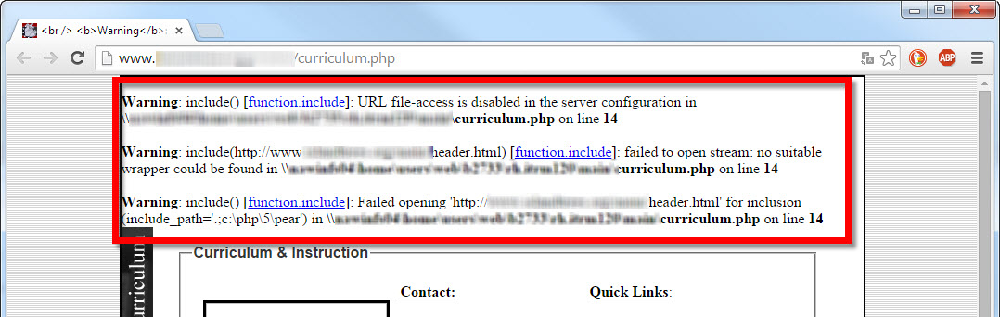

# LFI (Local File Inclusion)

## Introducción.
Una vulnerabilidad LFI se produce cuando, por necesidades de la aplicación web, se permite el acceso a ficheros locales de la aplicación sin los controles adecuados de seguridad.

Imaginad una aplicación PHP, en la que se ha implementado un mecanismo para ir a una página determinada indicando el destino mediante la URL, utilizando el siguiente código:

`https://miweb.com?pagina=siguiente.php`

```php
<?php
    include $_GET['pagina']
?>
```
Dado que pasamos por la URL el fichero de la página a la que quiero acceder, y puesto que no existe ninguna medidad de seguridad implementada, un actor malicioso puede intentar la siguiente jugada (path traversal):

`http://miweb.com?pagina=../../../etc/paswd`

Y obtener así acceso al fichero **/etc/passwd** o cualquier otro fichero confidencial.

## Detectando la vulnerabilidad
Tal como nos indican en <a href="https://www.welivesecurity.com/la-es/2015/01/12/como-funciona-vulnerabilidad-local-file-inclusion/" target="_blank">¿Cómo funciona una vulnerabilidad Local File Inclusion?</a>, una forma de detectar si un sitio web es vulnerable a LFI, sería añadiendo un texto cualquiera en la variable para ver si hace saltar un error o warning:



Imagen obtenida de: https://www.welivesecurity.com/la-es/2015/01/12/como-funciona-vulnerabilidad-local-file-inclusion/

Tal como indica en la guia OWASP (ver bibliografía), puede que la página tenga una cierta "protección":

```php
<?php include($_GET['file'].".php"); ?>
```
En la que añade la extensión del fichero para evitar que pongamos otro tipo de extensiones. No obstante, esta protección puede ser saltada mediante el caracter **NULL BYTE (%00)**, que permite ignorar aquello que se ponga después de dicho carácter. Por ejemplo:

`https://myweb.com?pagina=../../../etc/passwd%00` de forma que no se tenga en cuenta la extensión final ".php" que se le añade en el servidor.

Aunque se protegió contra la vulnerabilidad de NullByte injection en 2010 (PHP v5.3.4), nunca está de más mejorar la protección de nuestra aplicación con medidas adicionales.

## Mitigación de la vulnerabilidad LFI
- Evitar cargar páginas mediante la URL o en su defecto, disponer de una **white list** para comprobar que la página a la que se quiere acceder, está dentro de la lista.

```php
<?php
    $file = $_GET['file']; 

    // Lista blanca de paginas validas
    switch ($file) {
        case 'principal':
        case 'acerca':
        case 'contacta':
            include '/home/wwwrun/include/'.$file.'.php';
            break;
        default:
            include '/home/wwwrun/include/main.php';
    }
?>
```

- Insistiendo en la mitigación anterior, utilizar una forma de cargar la página más segura, haciendo referencia explicitamente a la página, sin dejar opción a carga por URL:

```php
<?php
    include ('pagina.php')
?>
```

- Limitar el acceso a archivos fuera del entorno permitido mediante el enjaulado a traves de **chroot**.
- Validar de forma estricta la entrada del usuario.
- Deshabilitar en la configuración de PHP las variables **allow_url_fopen** y **allow_url_include**, así como **register_globals**.

## Bibliografía.
- Pérez I. (12/01/2015). ¿Cómo funciona una vulnerabilidad Local File Inclusion?. welivesecurity. https://www.welivesecurity.com/la-es/2015/01/12/como-funciona-vulnerabilidad-local-file-inclusion/
- OWASP (s.f.). Testing for Local File Inclusion. https://owasp.org/www-project-web-security-testing-guide/v42/4-Web_Application_Security_Testing/07-Input_Validation_Testing/11.1-Testing_for_Local_File_Inclusion
- PHP.net. Cuestiones relacionadas a bytes nulos. https://www.php.net/manual/es/security.filesystem.nullbytes.php
